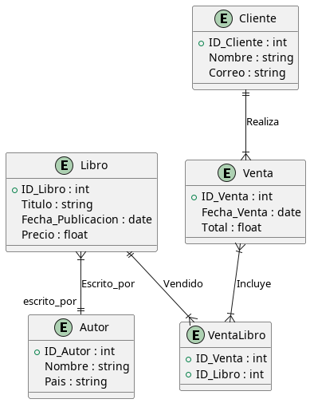

# Proyecto librería Javier y Luis
## Descripción
Nuestro programa consiste en una librería online para la venta de libros, la funcionalidad del programa 
ha sido realizada con Node.js, como motor gráfico hemos utilizado pug, y como sistema gestor de base de datos hemos utilizado mysql.

Javier se ha encargado de la parte de la venta del libro y Luis de la gestión del libro.
  
Para este proyecto hemos utilzado estas dependencias:
- body-parser
- dotenv
- express
- express-session
- mysql2
- pug
  

### Dependencias
Para la instalación de las dependencias hemos utilizado este comando:

``
npm install --save body-parser dotenv express express-session mysql2 pug
``

### Diagrama de entidades

.env
``
MYSQL_ROOT_PASSWORD=javiluis4
MYSQL_USERNAME=root
MYSQL_PORT=33307
MYSQL_HOST=localhost
MYSQL_DATABASE=libreria
ADMINER_PORT=8182
SERVICE_PORT=8000
``